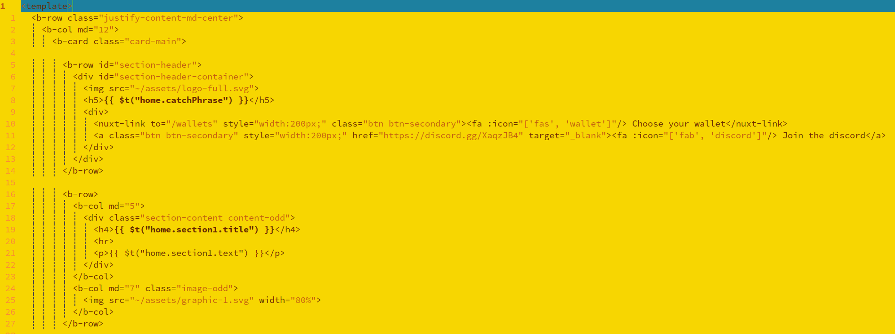
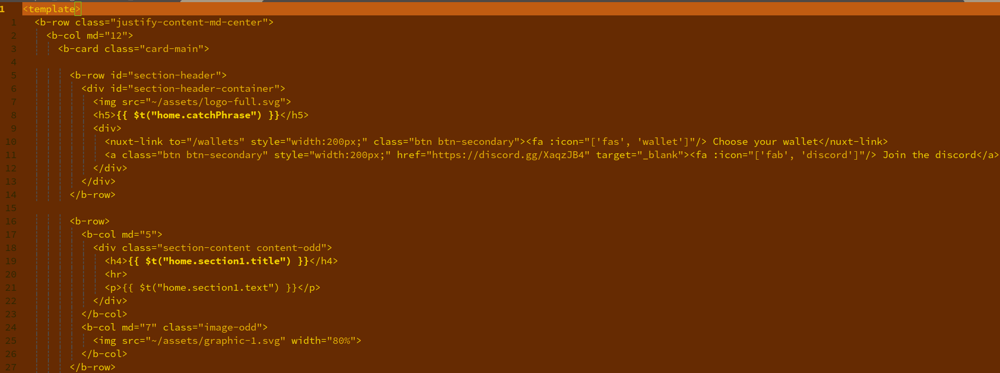
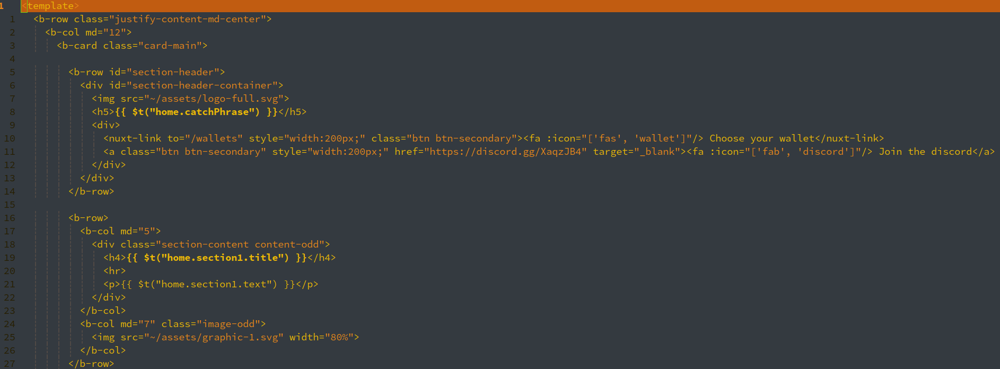

# 10grans-vim


A very early but grans color-scheme for NeoVim/Vim based of the colors from the 10grans [official website](https://10grans.cash/).
The goal of this color scheme is to make sure make that even while you are editing text you can experience friendship, finance, & fun.


This scheme may improve and become more fleshed out over time balancing the colors better. 
This repo is always open to any friends for merge requests to add or improve any of the schemes

----

## Screenshots

- `10grans-light.vim`



- `10grans-dark.vim`



- `10grans-black.vim`



----

```txt
   .-.
  ( G )
   '-'
```